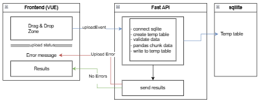

# Optimization Changes
* Changed the csv reader to use pandas as this saved ~3-5 seconds in time on larger million record files (About 20% decrease in time).
* Changed frontend to use Tailwind as stated in readme
* Only slightly gave the frontend a facelift (still could be improved)
* Added a failcase for missing headers in backend and one for missing header column (Saniity check)

# Production Hardening

Added pandas for faster data chunking and updating results

Used Sqlite to create a temp table for each upload

Added a file upload status bar to indicate upload progress using axios built in onUploadProgress

Added 2 more test cases to backend for bad headers to ensure it would still fail with a bad file

Added a drag and drop zone to the frontend for ease of use

Depending on use case this app could use AWS batch to report status and process jobs and polling could be used to fetch a job_id and the progress bar could then be extended to get the status from that job